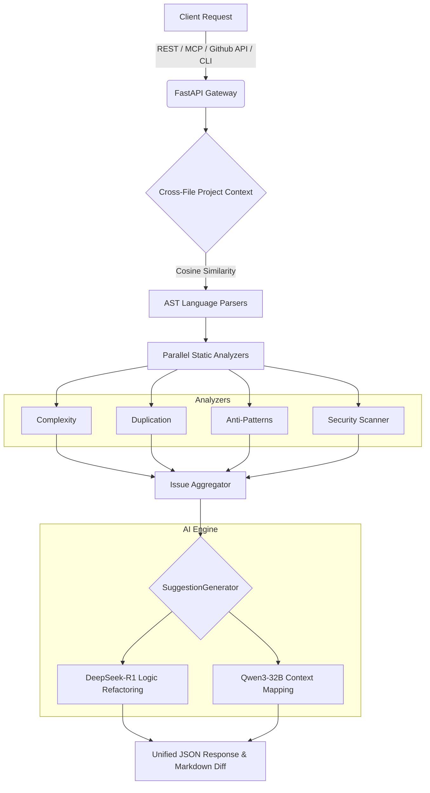

<!-- markdownlint-disable MD033 -->

<div align="center">
  
  <h1>🛡️ IntelliReview</h1>
  <p><strong>The Ultimate AI-Powered Code Review Ecosystem & Architectural Engine</strong></p>
  
  [](LICENSE)
  [](https://python.org)
  [](https://fastapi.tiangolo.com)
  [](https://react.dev)
  [](https://docker.com)
</div>

<br/>

> **IntelliReview** fuses traditional AST (Abstract Syntax Tree) static analysis with ultra-advanced Large Language Models (`DeepSeek-R1` & `Qwen3-32B`) to catch bugs, design flaws, and security vulnerabilities long before they reach production.

---

## ✨ Ecosystem At A Glance

| 🧩 Component | 📝 Description | 🔌 Integration |
| :--- | :--- | :--- |
| **Code Analyzer** | Multi-language AST parsing (Python, JS/TS, Java, C/C++) for zero-lag syntax analysis. | Backend Engine |
| **Agentic MCP Server** | Model Context Protocol exposing AI toolchains to Cursor / Claude Desktop. | `api/mcp_server.py` |
| **PR Auto-Reviewer** | Zero-touch GitHub Webhook CI/CD to natively comment on PR diffs with Auto-Fix patches. | `/api/v1/github` Webhook |
| **VS Code Extension** | Native IDE workflow that surfaces real-time diagnostics and squiggly warnings. | Editor Extension |
| **React Dashboard** | Real-time visual metrics, telemetry patterns, and team performance tracking. | Web Dashboard |
| **Terminal CLI** | Run code audits continuously inside your terminal natively. | CLI `intellireview` |

---

## 🧠 Architectural Flow

IntelliReview bridges localized syntax trees with cross-file context reasoning using LLM engines.



---

## 🚀 Quick Start

Ensure you have [Docker](https://docker.com) installed or Python 3.11+.

### 1. Environment Configuration

Clone the repository and bootstrap your local environment.

```bash
git clone https://github.com/yourusername/intelliReview.git
cd intelliReview
cp .env.example .env
```

Configure the `.env` securely. Minimal requirements:

```ini
HUGGINGFACE_API_KEY=hf_your_key_here
SECRET_KEY=generate_a_secure_random_key_here

# For GitHub PR Auto-Reviewer functionality:
GITHUB_TOKEN=ghp_your_personal_access_token
GITHUB_WEBHOOK_SECRET=your_secure_webhook_secret
```

### 2. Launch with Docker Compose

We recommend spinning up the entire microservice ecosystem via Docker:

```bash
docker-compose up -d
```

* **API:** `http://localhost:8000` (Docs: `http://localhost:8000/docs`)
* **Dashboard:** `http://localhost:3000`

---

## 📚 Advanced Integration Guides

IntelliReview exposes multiple enterprise-grade workflows natively.

<details open>
<summary><b>🔌 1. FastMCP Server: Agentic IDE Workflows</b></summary>
<br/>

IntelliReview exposes its code analysis engine as a FastMCP server. This allows AI agents within Claude Desktop or Cursor to autonomously analyze and fix codebase issues.

**Features of the MCP Server:**

* `analyze_code(code, language, filename)`: Runs the static analysis stack (complexity, duplication, anti-patterns, security, AI issues) and returns metrics alongside an AI executive review.
* `analyze_project(directory)`: Recursively scans a directory, running file-by-file static analysis and generating a holistic architectural AI review of the project's health.

**Integrating with Cursor / Claude Desktop:**

Add the following to your MCP settings JSON configuration:

```json
{
  "mcpServers": {
    "intellireview": {
      "command": "python",
      "args": ["<absolute-path-to-repo>/api/mcp_server.py"],
      "env": {
         "HUGGINGFACE_API_KEY": "hf_your_api_key_here"
      }
    }
  }
}
```

*Note: Make sure your Python environment has all IntelliReview dependencies installed (`mcp`, `huggingface_hub`), especially native hooks if available.*

</details>

<details open>
<summary><b>🤖 2. GitHub PR Auto-Reviewer</b></summary>
<br/>

IntelliReview features a fully automated integration with GitHub webhooks. It evaluates new or updated Pull Requests, scans all modified files, builds a zero-shot RAG project context, generates local dependency maps, and replies with rich inline comments directly in the PR timeline.

**How it works under the hood:**

1. Event listener automatically handles `opened` and `synchronize` payload actions for Pull Requests.
2. Modified code files are fetched securely.
3. Heavy computational analysis generates static metrics and identifies potential vulnerabilities.
4. Auto-Fixes block leverages `DeepSeek-R1` or `Qwen3-32B` to produce copy-pasteable unified diff blocks (` ```diff `) for PR authors!

**Setting it up:**

1. Generate a GitHub Personal Access Token (PAT) with `repo` permissions.
2. Create a Webhook Secret token.
3. Update your `.env` file to include both (`GITHUB_TOKEN` and `GITHUB_WEBHOOK_SECRET`).
4. Configure your repository Webhook on GitHub:

   * **Payload URL:** `https://your-domain.com/github` (or wherever your API gateway handles incoming GitHub POST actions)
   * **Content type:** `application/json`
   * **Secret:** *(the secret token you set above)*
   * **Events:** "Pull requests"

</details>

<details open>
<summary><b>🛠️ 3. VS Code Extension</b></summary>
<br/>

The IntelliReview VS Code extension bridges your local environment securely with the IntelliReview cloud/local engine. It connects your `.vscode` workflows directly with deep learning syntax analysis.

**Features:**

* Highlight security flaws, anti-patterns, and bad practices directly in your IDE with native diagnostics (red/yellow squiggly lines).
* Trigger manual file analysis with custom extension commands.
* Clear diagnostics globally using command palette.

**Usage Instructions:**

1. **Compile Extension:**

   ```bash
   cd vscode-extension
   npm install
   npm run compile
   ```

2. **Launch from VS Code:**

   Open the `vscode-extension` workspace natively and press `F5` to open an extension development host window.

3. **Configuration:**

   In settings, update `intellireview.serverUrl` to point to an active IntelliReview backend instance *(Default: `http://127.0.0.1:8000/api/v1`)*.
   You **MUST** provide an authentication token via `intellireview.apiToken` obtained from the Dashboard or by registering an account with the API.

4. **Commands Available:**

   Open the Command Palette (`Ctrl+Shift+P` / `Cmd+Shift+P`) and type `IntelliReview`:

   * `IntelliReview: Analyze Current File`
   * `IntelliReview: Clear Analysis Results`

</details>

---

## 💻 CLI Usage

The IntelliReview CLI provides a powerful terminal interface for local offline audits.

```bash
# Installation
pip install -e .

# Configure API endpoint mapping
intellireview config-set --key api_url --value http://localhost:8000

# Authenticate against your backend deployment
intellireview login

# Analyze a targeted file
intellireview analyze src/main.py

# Recursively crawl and audit a directory
intellireview analyze-dir src/ --recursive -l javascript
```

---

## ⚙️ Custom Settings (`.intellireview.yml`)

Set custom thresholds and override global analyzers natively per project root. Place this config globally or at your repository root:

```yaml
version: 1.0
analysis:
  languages:
    - python
    - javascript
  ignore:
    - node_modules/
    - venv/
  rules:
    complexity_threshold: 10
    max_function_length: 50
    line_length: 100
```

---

## 🧪 Testing & Deployment

IntelliReview utilizes an extensive PyTest automation suite simulating true Multi-Language workflows and performance benchmarks.

```bash
# Run isolated Unit Tests natively
pytest tests/unit/

# Run End-To-End API simulation 
python test_e2e.py

# Fast-deploy scaling configs to Cloud (Kubernetes native)
kubectl apply -f kubernetes/
```

<br/>

<div align="center">
  <p>🚀 Built with ❤️ using FastAPI, Hugging Face, React, and Python.</p>
  <p><a href="#-intellireview">⬆ Back to Top</a></p>
</div>
