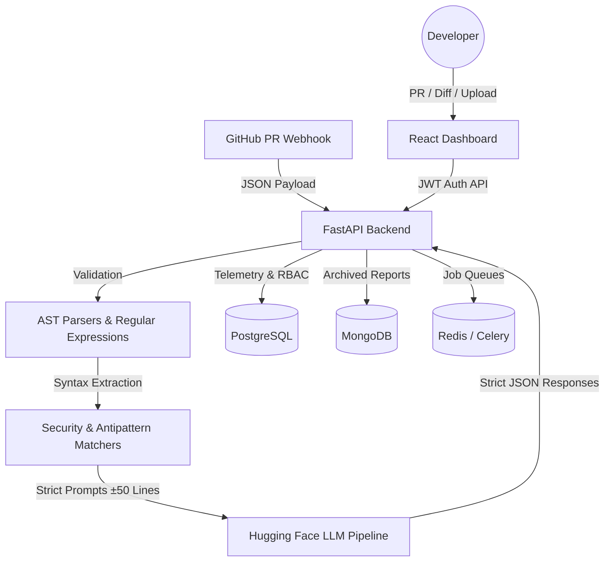

<div align="center">
  <div style="padding: 20px;">
    <h1>🔍 IntelliReview</h1>
    <p><em>Enterprise-Grade AI Code Review & Security Analysis Pipeline</em></p>
  </div>
  
  <div>
    <a href="LICENSE"></a>
    <a href="https://python.org"></a>
    <a href="https://reactjs.org"></a>
    <a href="https://fastapi.tiangolo.com"></a>
    <a href="https://docker.com"></a>
  </div>
  <br />
</div>

## 📖 What is IntelliReview?

**IntelliReview** is a sophisticated, self-hosted code analysis platform that bridges the gap between static deterministic linters (AST parsing) and probabilistic Large Language Models (LLMs). It acts as an automated, highly-accurate PR reviewer and security auditor.

### 🛑 The Problem
Standard AI review tools suffer from severe context drift, massive false-positive rates, and hallucinated suggestions. They complain about existing technical debt rather than focusing on the code being changed, leading to "notification fatigue."

### 💡 The Solution
IntelliReview solves this by employing a **Bounded Context Pipeline**. Unlike naive GPT wrappers, IntelliReview first extracts the Abstract Syntax Tree (AST) of the code using deterministic language parsers to find structural antipatterns and vulnerabilities. The LLM (e.g., DeepSeek-R1 or Qwen2.5) is only invoked on mathematically bounded line ranges (±50 lines around verified issues) to generate structural ` ```diff ` suggestions without context hallucination.

An integrated feedback telemetry loop automatically suppresses high-FPR (False Positive Rate) rules via PostgreSQL moving averages whenever users reject the AI's suggestions.

---

## 🏛️ System Architecture

IntelliReview operates as an asynchronous, multi-stage, event-driven pipeline.

1. **Intake**: Code enters via raw upload, Git diff patches, or automated GitHub PR Webhooks.
2. **Deterministic Stage**: Custom AST extractors process Python, JS/TS, Java, and C/C++.
3. **Probabilistic Stage**: An LLM maps findings to OWASP/CWE references and constructs precise, auto-applicable patch diffs.
4. **Data Layer**: Relational telemetry and Role-Based Access Control (RBAC) are powered by PostgreSQL, while high-throughput analysis reports are archived in MongoDB. Redis powers asynchronous Celery task queues. 



---

## ✨ Features (v1.5)

| Category | Feature | Description | Status |
| :--- | :--- | :--- | :--- |
| **Analysis** | **Deterministic AST** | Structural syntax parsing for Python, JS/TS, Java, C/C++. | ✅ Implemented |
| **Analysis** | **Diff Review Engine** | Paste terminal `git diff` outputs to analyze only modified lines. | ✅ Implemented |
| **LLM Engine** | **Contextual Chunking** | LLM context strictly bounded to prevent hallucination overhead. | ✅ Implemented |
| **Security** | **OWASP/CWE Tagging** | Automatic mapping of vulnerabilities to security standards. | ✅ Implemented |
| **Customization** | **Custom YAML Rules** | Define regex/structural matchers via `.intellireview.yml`. | ✅ Implemented |
| **Customization** | **Live Rule Tester UI** | Test your YAML custom rules instantly against code in the browser. | ✅ Implemented |
| **Intelligence** | **Active Telemetry** | Auto-tuning moving averages that suppress frequently rejected AI rules. | ✅ Implemented |
| **Enterprise** | **Role-Based Access** | Secure JWT authentication with Admin, Reviewer, and Developer roles. | ✅ Implemented |
| **Enterprise** | **Audit Logging** | Immutable tracking for config modifications and rule suppressions. | ✅ Implemented |

---

## 🚀 Quick Start

### 1. Docker Compose (Enterprise Scale)
The recommended way to deploy IntelliReview. Spins up FastAPI, the React Dashboard, PostgreSQL, MongoDB, Redis, and an Nginx reverse proxy.

```bash
# 1. Clone the repository
git clone https://github.com/aminul01-g/IntelliReview.git
cd IntelliReview

# 2. Setup your environment
cp .env.example .env

# 3. Launch the stack
docker-compose up -d --build
```

**Access Points:**
- **Dashboard UI**: `http://localhost:3000`
- **FastAPI Backend**: `http://localhost:8000`
- **OpenAPI Swagger**: `http://localhost:8000/docs`

### 2. Manual Development Setup
For local hacking or running the CLI without containers.

```bash
# 1. Setup Python Virtual Environment
python3.11 -m venv .venv
source .venv/bin/activate

# 2. Install Dependencies
pip install -r requirements-dev.txt

# 3. Run FastAPI Application
uvicorn api.main:app --reload --host 0.0.0.0 --port 8000
```
> **Note:** If `DATABASE_URL` is omitted in the `.env`, the system safely falls back to a local SQLite database, making it fully portable (as deployed on Hugging Face Spaces).

---

## 🔌 Integrations

### GitHub Pull Request Webhooks
IntelliReview can actively monitor your repositories.
1. Go to your GitHub Repository -> Settings -> Webhooks.
2. **Payload URL**: `https://<your-domain>/api/v1/webhooks/github`
3. **Content type**: `application/json`
4. **Events**: Select `Pull requests` and `Issue comments`.

### Visual Studio Code Extension
Bring AI analysis directly to your IDE gutters.
```bash
cd integrations/vscode
npm install
npm run compile
```
Press `F5` in VS Code to launch the Extension Development Host.

### Model Context Protocol (MCP) Server
Expose IntelliReview tools directly to Cursor, Claude Desktop, or standard MCP clients.
```json
// claude_desktop_config.json
{
  "mcpServers": {
    "intellireview": {
      "command": "python",
      "args": ["/path/to/IntelliReview/api/mcp_server.py"]
    }
  }
}
```

---

## 🛠️ CLI Usage

IntelliReview ships with a robust Python CLI for CI/CD pipeline integration and machine learning benchmarking.

**1. Analyze a single file:**
```bash
python -m cli.cli analyze path/to/file.py
```

**2. Run False Positive Rate (FPR) Telemetry Benchmark:**
Tests core rules against known vulnerability data fixtures to calibrate confidence thresholds.
```bash
python scripts/benchmark_fpr.py /path/to/repo --threshold 0.3
```

**3. Seed Database:**
Injects default Admin user and base enterprise rules.
```bash
python scripts/seed_data.py
```

---

## ⚙️ Configuration (`.intellireview.yml`)

Project-specific behavior is controlled by checking an `.intellireview.yml` file into your repository root. You can test these rules interactively in the **Custom Rules** tab of the React dashboard.

```yaml
rules:
  - id: "no-eval-in-prod"
    pattern: 'eval\('
    message: "Security: Never use eval() — critical RCE risk."
    severity: "critical"
    languages: ["python", "javascript"]
    
  - id: "ban-console-log"
    pattern: 'console\.log\('
    message: "Use a structured logger."
    severity: "low"
    languages: ["javascript", "typescript"]

limits:
  max_line_length: 120
  max_file_lines: 800
```

---

## 🔒 Security & Authorization

- **Authentication**: Fully relies on **HttpOnly Secure Cookies** handling signed JWTs.
- **RBAC**: Handled natively. Features like `Rule Adjustments` or `Project Deletions` route exclusively through to users with the `Admin` or `Reviewer` role enum in Postgres.
- **Secrets**: API Keys (OpenAI, HuggingFace, Anthropic) are **never practically logged** and must be injected via the server's `.env` or CI secrets.
- **Dependencies**: Analyzers execute against Abstract Syntax Trees (ASTs) rather than dynamically running/`eval`-ing code, guaranteeing the host server cannot be compromised by malicious code execution vectors.

---

## 🗺️ Roadmap (v2.0)

While v1.5 hardered the deployment infrastructure and LLM bounding box, the next major iterations will focus on collaboration:
- [ ] **OpenID Connect (OIDC)**: Fully functional GitHub/Google SSO flows replacing the current `/auth/github` API stubs.
- [ ] **Multi-Agent Consensus**: Routing deeply complex files through a Swarm architecture where multiple LLMs "vote" on a flag before alerting the user.
- [ ] **Real-time Collaboration**: WebSockets for live, simultaneous multiplayer review sessions inside the dashboard.

---

<div align="center">
  <br>
  <p><b>IntelliReview</b> — Built for teams tired of noisy AI reviewers.</p>
  <p>To run the test-suite: <code>pytest tests/</code></p>
</div>
