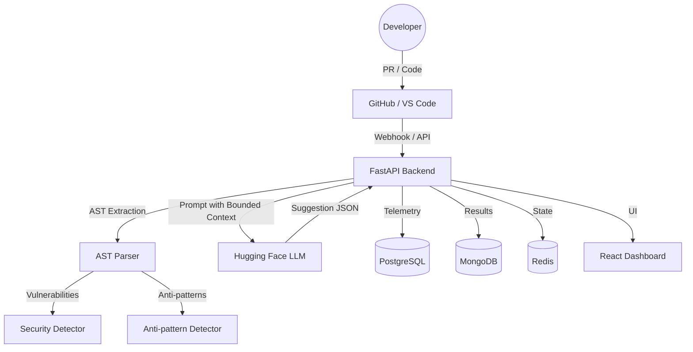

[](LICENSE)
[](https://python.org)
[](https://docker.com)

IntelliReview is a code analysis pipeline that combines Abstract Syntax Tree (AST) parsing with Large Language Models for automated PR reviews and security auditing.

IntelliReview addresses the excessive noise and context drift common in standard AI review tools. It solves the problem of notifications fatigue by focusing strictly on modified code blocks and maintaining project-specific architecture maps. The system ensures that logic refactoring adheres to existing abstractions rather than generating isolated code snippets.

IntelliReview operates as a multi-stage analyzer. Source code is first processed by language-specific AST parsers to extract structural metadata and identify known anti-patterns. This context is then processed by a dual-model LLM pipeline (DeepSeek-R1 for logic and Qwen2.5 for context) to generate review suggestions within mathematically bounded line ranges. Results are stored in PostgreSQL for telemetry and MongoDB for archival, with a React-based dashboard providing a UI for feedback loops and weight adjustments.



| Feature | Description | Status |
| :--- | :--- | :--- |
| **AST Analysis** | Structural parsing for Python, JS/TS, Java, C/C++. | Implemented |
| **Contextual Chunking** | LLM prompts limited to ±50 lines around violations. | Implemented |
| **Security Mapping** | Violation tagging with CWE IDs and OWASP references. | Implemented |
| **RBAC** | Role-based access control (Admin, Reviewer, Developer). | Implemented |
| **Active Feedback** | Moving-average rule weighting based on user rejection. | Implemented |
| **Audit Logging** | Immutable logs for configuration and suppression changes. | Implemented |

### 1. Docker Compose (Recommended)
Clone the repository and define your environment secrets in a `.env` file before launching.

```bash
cp .env.example .env
docker-compose up -d
```

Services will be available at:
- API: `http://localhost:8000`
- Dashboard: `http://localhost:3000`
- API Documentation: `http://localhost:8000/docs`

### 2. Manual Python Setup
For development or CLI-only usage, use a virtual environment with Python 3.11.

```bash
python -m venv venv
source venv/bin/activate
pip install -r requirements.txt
python -m api.main
```

### GitHub Webhook Integration
IntelliReview listens for Pull Request events. Configure your repository webhook to point to the following endpoint:
- **Payload URL**: `https://<your-domain>/api/v1/webhooks/github`
- **Events**: `pull_request`, `issue_comment`

### VS Code Extension
The extension provides inline diagnostics. To build locally:
```bash
cd vscode-extension
npm install
npm run compile
```

### MCP Server
Expose analysis tools to Cursor or Claude Desktop by adding this to your configuration:
```json
{
  "mcpServers": {
    "intellireview": {
      "command": "python",
      "args": ["/app/api/mcp_server.py"]
    }
  }
}
```

The CLI provides local audit capabilities and benchmarking tools.

**Analyze a file:**
```bash
python analyzer/main.py path/to/file.py
```

**Run False Positive Rate (FPR) benchmark:**
```bash
python scripts/benchmark_fpr.py /path/to/repo --threshold 0.3
```

**Seed initial database state:**
```bash
python scripts/seed_data.py
```

Project behavior is controlled via `.intellireview.yml` in the repository root.

| Key | Type | Description |
| :--- | :--- | :--- |
| `rules` | List | Definiton of custom pattern-matching or length rules. |
| `rules.pattern` | Regex | String pattern to identify banned code. |
| `rules.max_line_length` | Integer | Maximum allowed characters per line. |
| `rules.max_file_lines` | Integer | Maximum allowed lines per file. |
| `rules.languages` | List | Target languages for a specific rule. |
| `rules.severity` | String | Severity level: critical, high, medium, low. |

IntelliReview uses JWT for session management and PBKDF2 for password storage in PostgreSQL. The system supports OAuth2 (SSO) stubs for GitHub integration. Access depends on localized Roles (RBAC), and all administrative actions are captured in the `audit_logs` table.

The system is currently in v1.5. Planned for v2:
- Full OpenID Connect (OIDC) implementation.
- Multi-agent consensus (voting on flags by multiple LLMs).
- Real-time collaborative review sessions.
- Dynamic plugin system for custom AST detectors.

Contributions must include unit tests and pass the standard linting suite.
```bash
pytest tests/
```
Please submit Pull Requests to the `develop` branch.
